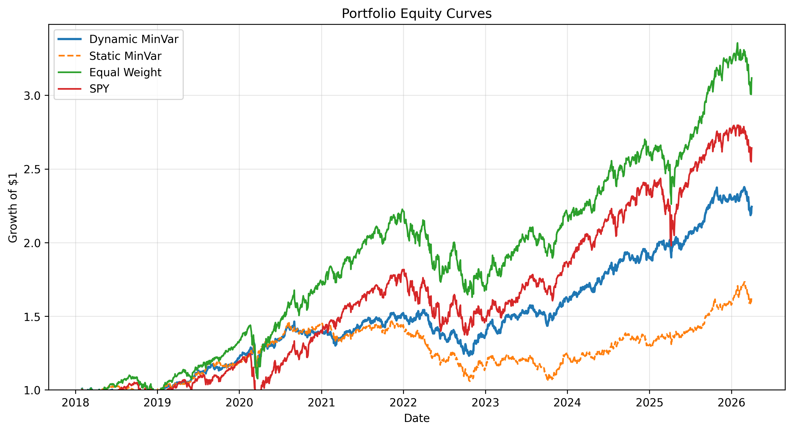

# Portfolio Optimisation ML - Volatility Forecasting and Risk-Based Allocation

A practical project that forecasts short-term volatility (risk) and uses it together with rolling correlations to build a covariance matrix and compute long-only portfolio weights (minimum-variance). The strategy is evaluated with walk-forward backtesting to avoid look ahead bias and data leakage.

---



The dynamically rebalanced minimum-variance portfolio delivered more stable growth than the market benchmark by actively controlling portfolio risk. While the strategy did not always maximise raw returns, it reduced volatility and drawdowns, resulting in competitive risk-adjusted performance.

This demonstrates the effectiveness of volatility-based allocation and highlights how disciplined portfolio construction can improve consistency compared to passive exposure.

## What this project does

**Goal:** improve risk-adjusted performance by controlling portfolio risk.

**High-level loop (walk-forward):**
1. Load adjusted close prices → compute daily returns
2. Engineer features (lags + rolling statistics)
3. Forecast next-day volatility (ML models + baseline)
4. Estimate rolling correlation across assets
5. Construct covariance matrix
6. Solve for long-only minimum-variance weights
7. Rebalance periodically and backtest equity curve + risk metrics

---
- I designed a full pipeline that connects **financial data → ML forecasting → risk model → constrained optimisation → walk-forward backtest**.
- I used a time-based split and benchmarked against a rolling-volatility baseline to prevent misleading ML results.
- Results showed the baseline rolling volatility estimator outperformed Ridge and Random Forest for RMSE/MAE (consistent with volatility clustering), so the baseline is used for the optimisation stage and ML is retained for comparison/experimentation.

---

## Repository structure

```text
Portfolio-Optimisation-ML/
├── data/
│   ├── raw/
│   │   └── prices.csv              # Adjusted close prices (input)
│   └── processed/
│       ├── features.csv            # Engineered features + target
│       └── weights_minvar.csv      # Saved min-var weights (output)
│
├── models/
│   ├── ridge_scaler.pkl            # Fitted StandardScaler for Ridge
│   └── ridge_vol_model.pkl         # Trained Ridge volatility model
│
├── notebooks/
│   └── (exploration / diagnostics)
│
├── scripts/
│   ├── data_fetch.py               # Fetch/update price data
│   ├── make_features.py            # Build features.csv
│   ├── train_models.py             # Train/evaluate volatility models
│   └── get_weights.py              # Optimise weights + run backtest
│
├── src/ml_optimisation/
│   ├── config.py                   # Global settings (windows, tickers, etc.)
│   ├── preprocess.py               # Returns + features engineering utilities
│   ├── models_sklearn.py           # Baseline, Ridge, RandomForest training/eval
│   └── portfolio.py                # Risk model + optimisation logic
│
├── requirements.txt
└── README.md
```

---

## Core concepts
This are the notes of what i learned along the way by doing the project

### Prices vs returns
We do not model raw prices. We model returns:

```python
returns = prices.pct_change()
```

If price moves from 100 to 102:

$r = (102/100) - 1 = 0.02$


Returns are more suitable for modelling because prices are non-stationary.

### Volatility (risk)
Volatility is estimated via rolling standard deviation:

```python
roll_std_20 = returns.rolling(20).std()
```

Markets show volatility clustering, so volatility is often more predictable than returns.

---

## Feature engineering

Features are built from returns to capture different time horizons cleanly.

### Lag features
I use selected lags to represent different horizons without redundancy:

```text
ret_lag_1 → yesterday (short shock)
ret_lag_2 → 2 days, very recent continuation/reversal
ret_lag_5 → 1 trading week
```

Why not include every lag 1..5?
- Adjacent lags are highly correlated → redundancy/multicollinearity
- Rolling stats already summarise the window
- Selected lags give a compact multiscale view

### Rolling statistics
Rolling features summarise recent behaviour:

```text
roll_mean_5 → short-term trend
roll_std_5  → weekly volatility
roll_std_20 → monthly volatility
```

---

## Volatility forecasting

Target is next-day volatility, created by shifting rolling volatility:

```python
target_vol = roll_std_20.shift(-1)
```

Interpretation:
> At day t, use information available up to t to predict volatility at **t+1**.

---

## Models 

Implemented in: `src/ml_optimisation/models_sklearn.py`

### Time-based split
Training/validation uses chronological order:

```text
first ~70% of dates → train
last  ~30% of dates → validation
```

Thisavoids leakage.

### Baseline: rolling volatility persistence
Finance baselines are strong. Rolling volatility often beats ML in noisy regimes.

### ML models
- Ridge regression (scaled using standardscalar)
- RandomForestRegressor
- Neural networks explored experimentally (not used for the optimisation stage)

### Scaling
For linear models, scaling is critical:

```python
from sklearn.preprocessing import StandardScaler
scaler = StandardScaler()
```

---

## Model performance snapshot

From the current run logs:

- Train size: 5,614  
- Validation size: 2,406  

Baseline (rolling vol) performance:
  - RMSE: 0.000991
  - MAE:  0.000449

Ridge:
- RMSE: 0.001340
- MAE:  0.000640

Random Forest:
- RMSE: 0.001358
- MAE:  0.000625

**Finding:** the rolling-volatility baseline achieved **lower RMSE and MAE** than both ML models, consistent with volatility persistence. The baseline is therefore used in the portfolio optimisation stage, with ML retained as experimental comparisons.

---

## Risk model: correlation → covariance (diversification)

Portfolio risk depends on co-movement.

Instead of directly estimating covariance from returns (often noisy/unstable), I decompose:

$Σ_{ij}=σ_iσ_jρ_{ij}$

Where:
- $σ_i$ is the predicted volatility of asset i
- $ρ_{ij}$ is the rolling correlation between i and j

Correlation is scale-free and typically more stable than raw covariance.

---

## Portfolio optimisation (long-only minimum variance)

Default objective:

\[
$\min_w \; w^T \Sigma w$
\]

Subject to:
- $\sum_i w_i = 1$
- $w_i \ge 0$ (long-only)

This produces a risk-controlled allocation without leverage.

Outputs:
- Weights saved to: `data/processed/weights_minvar.csv`

---

## Walk-forward backtesting

Backtesting simulates running the strategy in the past using only information available at each time step.

At rebalance day **t**:
- compute vol estimates using returns up to **t**
- compute correlation using a rolling window ending at **t**
- build $σ(t)$
- solve for weights $w(t)$

Then on day t + 1:
- $R_p(t+1) = w(t)^T r(t+1)$
- $V(t+1) = V(t)\,(1 + R_p(t+1))$
---
This avoids using future vol/correlation to decide today’s weights, fitting on the full dataset and “testing” on it and any look-ahead bias

---

## Backtest outputs and metrics

From the portfolio return series $R_p(t)$ and equity curve $V(t)$, the backtest computes:

- **Equity curve** $V(t)$
- **Annualised return** $252 \cdot \text{mean}(R_p)$
- **Annualised volatility** $\sqrt{252}\cdot \text{std}(R_p)$
- **Sharpe ratio** $(\mu_{ann} - r_f)/\sigma_{ann}$ (often $r_f=0$ for simplicity)
- **Max drawdown** (largest peak-to-trough decline)

---

## Benchmarks

A backtest is only meaningful relative to baselines:

1. **Equal-weight portfolio**
2. **Buy & hold market benchmark**
3. **Static minimum variance** (one covariance estimate, no rebalancing)

---

## How to run


## Configuration

Core parameters (tickers, rolling windows, correlation window, rebalance frequency, paths) live in:

- `src/ml_optimisation/config.py`

---

## Limitations and future work

Planned improvements

- Transaction costs, slippage, and turnover constraints
- Covariance shrinkage / regularisation for more stable weights
- Weight caps and additional constraints (sector, max single-asset exposure)
- Larger asset universe and regime-based robustness checks
- More robust expected return modelling (optional; risk-first is the current focus)

---

## Summary

This project forecasts short term volatility using return based features, benchmarks ML models against a strong rolling volatility baseline, then constructs correlation based covariance matrices to compute long-only minimum variance portfolio weights. The strategy is evaluated via a walk-forward backtest with benchmark comparisons to ensure realistic, leakage free performance assessment and a clear focus on risk-adjusted outcomes.

---
